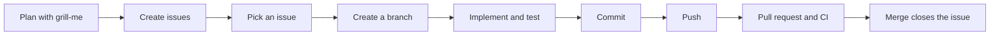

# Development workflow

How work goes from an idea to a merged change. Most steps are backed by something in the repository (issue template, git hooks, CI and the rules in `AGENTS.md`). The pull request format, the merge method and closing the issue from the pull request (sections 8 and 9) are conventions defined here.



## 1. Plan with `grill-me`

Before creating tasks, run the `/grill-me` skill and describe the feature, page or decision to plan. It interviews you one question at a time, walks down each branch of the decision tree, gives a recommended answer for every question and explores the codebase instead of asking whenever the code can answer.

The output of that session is a set of decisions. Turn them into tasks, each one small enough to fit in a single pull request.

## 2. Create the issues

Create each task from the **Task** template (`.github/ISSUE_TEMPLATE/task.md`), in the GitHub UI or with `gh issue create`:

| Section | What goes in it                                                                                                                         |
| ------- | --------------------------------------------------------------------------------------------------------------------------------------- |
| Context | Why the task exists and the current state. Describe the problem, not the solution.                                                      |
| Tasks   | A checklist with one verifiable deliverable per item. Use `code` for routes, files and components.                                      |
| Notes   | Optional. Decisions already made, what is **not** part of the issue and which issues it depends on (`Depends on ...`). Remove if empty. |

Then:

- Assign the issue to a milestone. They are ordered: **Foundation**, **Home**, **Blog** and **Launch**.
- Write the title as a short imperative summary, for example `Header and footer`.
- Record dependencies in Notes, so the order of work is explicit.

## 3. Pick an issue

Take the next open issue of the current milestone whose dependencies (the `Depends on ...` lines in Notes) are already closed. Read the whole issue, including Notes, before starting.

## 4. Create a branch

Never work on `main`. Branch names follow `<scope>/<title>#<issue>`, or `<scope>(<target>)/<title>#<issue>` for very specific work (see Branch Rules in [`AGENTS.md`](../AGENTS.md)). Quote the name, since `(` and `#` are special characters in shells:

```bash
git switch main && git pull
git switch -c 'feat(home)/hero#7'
```

## 5. Implement and test

- Read the relevant guide in `node_modules/next/dist/docs/` before writing Next.js code: this version has breaking changes.
- Use the Context7 MCP for the documentation of any other library, framework or CLI.
- Adding a shadcn/ui or shared component? Use the `new-component` skill.
- Designing or reshaping UI? Use the `frontend-design` and `impeccable` skills.
- After changing anything under `src/app/components`, `src/app/(pages)` or `src/app/styles`, run the `ui-reviewer` subagent.
- Install dependencies with `pnpm add -E <pkg>` (or `pnpm add -D -E <pkg>`), so versions stay pinned.
- Add or update tests alongside the code: unit tests as `src/**/*.test.{ts,tsx}` (Vitest) and end-to-end tests in `src/tests/e2e` (Playwright).
- If the task changes a convention, update `AGENTS.md` and `README.md` in the same branch.

Check locally before committing:

```bash
pnpm type-check && pnpm eslint:check && pnpm prettier:check && pnpm test
```

## 6. Commit

Follow the Commit Rules in [`AGENTS.md`](../AGENTS.md): English, imperative, lowercase, with a body and an `Issue: #<number>` line. Type the plain prefix (`feat: ...`) and the `commit-msg` hook adds the emoji.

- Keep each commit a single logical change.
- Body lines are limited to 100 characters by `commitlint`; a longer line rejects the commit.
- `pre-commit` runs `lint-staged` (Prettier, ESLint and `vitest related`) on the staged files.
- Stage only the files that belong to the change.

## 7. Push

```bash
git push -u origin 'feat(home)/hero#7'
```

`pre-push` runs `pnpm type-check` and the full Playwright suite. The push is rejected if either fails.

## 8. Open the pull request

Open a pull request against `main` (`gh pr create` or the GitHub UI):

- **Title:** a short summary of the change.
- **Body:** a `Summary` (what changed and why), a `Test plan` (what was checked) and `Closes #<issue>` so that merging closes the issue.
- **CI** (`.github/workflows/ci.yml`) runs commitlint over the PR's commits, type-check, ESLint, Prettier, unit tests and E2E tests. Everything must be green.

## 9. Merge and close

1. In the issue, tick every completed checklist item (`- [x]`). Do not close an issue with unchecked items unless they were dropped or moved, and say so in a comment.
2. Merge with **Rebase and merge**, which keeps each commit and a linear history (CI lints every commit of the PR).
3. Delete the branch, then update the local `main`:

   ```bash
   git switch main && git pull
   git branch -d 'feat(home)/hero#7'
   ```

4. Confirm the issue is closed as completed.

## Changes without an issue

Documentation or workflow changes that have no issue also have no branch name to follow. Commit them to `main` only when that was agreed explicitly. CI only runs on pull requests, so the git hooks are the only gate for these.
